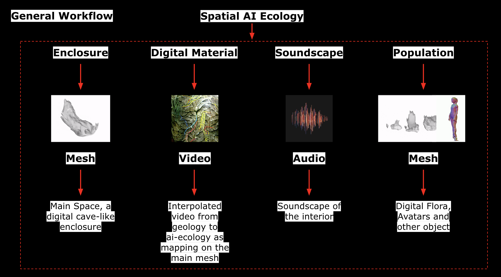
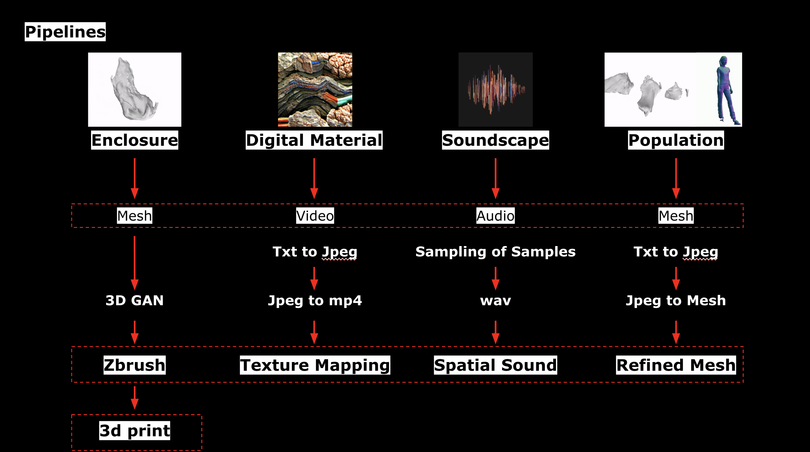

# latent-glitch

Spatial AI Ecologies explores creative AI in a collaborative fashion to produce a new cognition of interiority. Rooted in the material basis of intelligence, and how geology, biology and technology interact, the work utilizes ai algorithms to construct a new intriority; an amalgam of media created using AI.

The following algorithms have been used:
* **3D GAN**: Following this paper [Improved Adversarial Systems for 3D Object Generation and Reconstruction
](https://arxiv.org/abs/1707.09557) we built a GAN model that generates AI 3D meshes. Check [michleangelo](https://github.com/ysinjab/latent-glitch/tree/main/michelangelo)

* **AI Generated music**: We used [Open AI Jukebox](https://openai.com/blog/jukebox/) to generate music. The notebook can be found here: [jukebox.ipynb](jukebox.ipynb) and here you can find samples of the [results](https://drive.google.com/drive/folders/1Rpavs5GyU_tbippR_llm6VVSjo1DPmM-?usp=sharing).

* **Text to image**: We used [Open AI DALL-E](hhttps://openai.com/blog/dall-e/) to generate images from text. The notebook can be found here: [text_to_image_dalle_ipynb.ipynb](text_to_image_dalle_ipynb.ipynb)

* **MeshRCNN**: MeshRCNN can predict 3D objects from 2D images. The notebook can be found here: [MeshRCNN.ipynb](MeshRCNN.ipynb)

* **PIFuHD**: We used [PIFuHD: Multi-Level Pixel-Aligned Implicit Function for High-Resolution 3D Human Digitization](https://shunsukesaito.github.io/PIFuHD/) to reconstruct 3D representation object from of a 2D image. The notebook can be found here: [PIFuHD.ipynb](PIFuHD.ipynb)

* **VQGAN+CLIP**: We used [VQGAN](https://github.com/CompVis/taming-transformers) and [CLIP](https://openai.com/blog/clip/) to generate images from a text prompt. The notebook can be found here: [VQGAN+CLIP.ipynb](VQGAN+CLIP.ipynb). Results can be found here: https://drive.google.com/drive/folders/1nuqL9pS9_l9iP_-WEt4TAdDa5bQjVIbY?usp=sharing