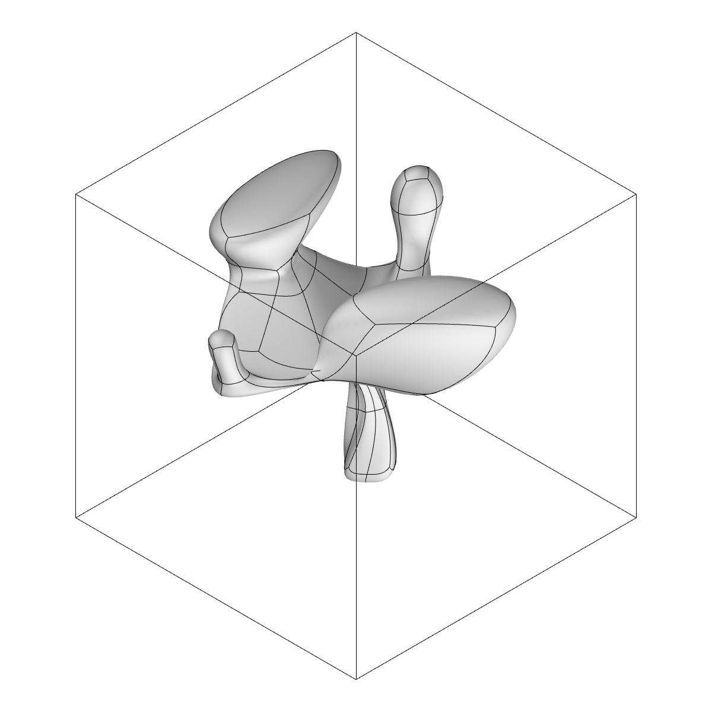

# Michleangelo

Here you will find all the materials used to train & generate AI 3D meshes objects.

 

## Dataset

* The dataset consists of two main files:
  * Reference (example: Listlength_Ref_001.txt)
  * Points (example: T_001.txt)

Points file contains the points of all generated meshes. Reference file denotes the index of last point of every mesh. For example: the first line in Listlength_Ref_001.txt is 254, so the points that constructs our first mesh is first 254 lines from T_001.txt file. Same goes with Listlength_Ref_002.txt: the first line value is 218, so the points that construct the first mesh is the first 218 lines in T_002.txt file.

### Samples of the dataset

 

### Processing

In order to train machine learning model it is required to create 3d array to represent those voxel meshes. In Michelangelo_data.ipynb you will find all the steps where it ends by saving those arrays on disk as .npz files using numpy library.

## Training and generating 3D objects
In Michelangelo.ipynb you will find the implmenetation of GAN netowrk to generate 3D meshes. Samples of training and checkpoints will be found on google drive : https://drive.google.com/drive/folders/15dMzHRn7M-jKd-B5olve6ZwBS93FX5bp?usp=sharing

### Samples Output 

<!--  -->

